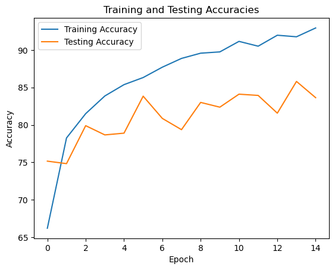
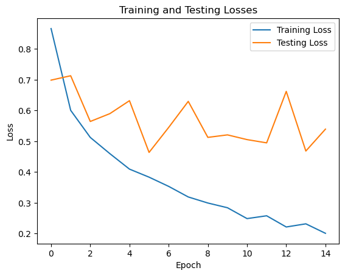

# Intel-Image-Classification-Transfer Learning
- Using MobileNet : https://pytorch.org/hub/pytorch_vision_mobilenet_v2/
- This was a continuation of my other repository: https://github.com/AimanHadif/Intel-Image-Classification which tackles the image classification tasks using Deep Learning (CNN)
- Image classification using Transfer Learning (Pretrained Model) PyTorch format of Intel Image Classification dataset
- Link to Dataset: https://www.kaggle.com/datasets/puneet6060/intel-image-classification
- The model manages to get 92.93% Training Accuracy and 83.63% Testing Accuracy which performs better than CNN (https://github.com/AimanHadif/Intel-Image-Classification)

## Training Results
- The settings of the image size can be tuned depending on your experiments
- This code takes the image into 224x224 size image

1. Training Accuracy

2. Testing Accuracy

## Testing Results
- Inference was done using the Intel_CNN_Inference.ipynb script in this repo
- There are 2 options to output the inference
  > Pie Chart  
  > Bar Plot
- There are also 2 preprocessing in the test folder which are
   > Masking the Image  
   > Unmasking the Image (normal)
- Refer to https://github.com/AimanHadif/Image-Masking for details on Masked Image
- Example output will produce the file for class and the each image predicted in the class, the visualization (pie/bar), and CSV file of the filename and the predicted label

1. Pie w/ Mask
   
2. Pie w/o Mask
   
3. Pie (Both Mask and No Mask)
   
4. Bar w/ Mask
   
5. Bar (Both Mask and No Mask)
  

## Error
- There should not be any error unless you've changed the input size, and the number of classes. If that is the case then refer back to the CNN architecture to adjust the output number and the image size on the final layer
- If you found any error while implementing this code with different datasets. Please understand the code completely especially in the inference script
- If the error is still unsolvable, feel free to reach me
